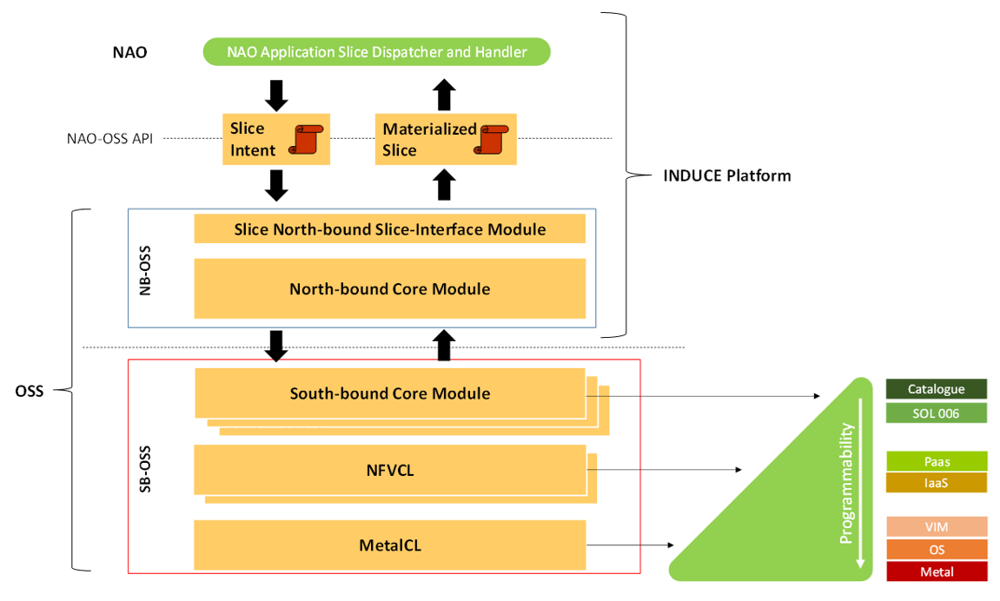

<!-- PROJECT DESCRIPTION -->

# 📖 The 5G Operation Support System (OSS)

The <a href="[#readme-top](https://www.5g-induce.eu/)">5G-INDUCE</a> Operations Support System (OSS), depicted in figure below, is in charge of managing all functions and operations required for the nApp placement over edge computing facilities and for its connection to a (properly configured) network slice, as well as maintaining the information on all the data regarding the deployed applications, network services, and available infrastructure resources. 

The OSS is designed according to a highly modular architecture: all the software services are state-of-the-art cloud-native software, i.e., stateless services (or more precisely services with a state maintained in an external database; namely, MongoDB and Prometheus), inherently parallelizable. 
The 5G-INDUCE OSS architecture is organized in a suite of five main software services, grouped into two main modules: the North-Bound OSS (NB-OSS) and the South-Bound OSS (SB-OSS). 
The former module is meant to front-facing the NAO by managing slice negotiations for nApps, and to maintain metadata (e.g., coverage area served, operational capabilities, etc.) of one or multiple onboarded SB-OSS modules. 

The SB-OSS is meant once per each different administrative network/computing resource domain onboarded onto the OSS. 
To reflect the different programmability levels exposed by such administrative domains (e.g., the various ExFa testbeds), the SB-OSS has been designed as a chain of software services that can be selectively activated to gain access to various programmability levels, passing from a simple catalogue of available resources in case of no programmability, up to the complete terraforming of the physical infrastructure in case of full programmability. 
Even if not made explicit in the following, in order to maximize the flexibility of the approach, the SB-OSS will have the capability to maintain different programmability levels for edge computing and network (service/slice) resources in the same administrative domain. 

In more detail, the NB-OSS is composed of two main services: the Slicing-Interface and the North-Bound Core services. 
The Slicing-Interface service is meant to implement the OSS APIs for the interface with the NAO. 
The NB Core service is in charge of two main tasks: onboarding SB OSS instances, and suitably process and propagate slicing requests/replies between the Slicing-Interface service (and then the NAO) and the relevant SB-OSS(es). 

The SB-OSS will include three “chained” services: the South-Bound Core service, the NFV Convergence Layer (NFVCL), and the Metal Convergence Layer (MetalCL). 
The South-Bound Core service is the only mandatory element in the SB-OSS, and it is devoted to process the slice instantiation/modification/de-instantiation requests and related resources. 
This service is the key component for providing adaptive programmability: if the NFVCL and the MetalCL services are available, the SB Core can request them the setup or the change of new or existing network slices/services and of infrastructure resources (e.g., of OpenStack VIM instances and of the hosting physical servers). 
In case that bare-metal or virtualization programmability levels in an administrative domain are not exposed to the 5G-INDUCE platform, the SB-Core can dynamically request an external NFV framework for the needed slices/configurations, or simply cataloguing the pre-configured resources (e.g., a 5G network slice) statically dedicated to the 5G-INDUCE platform. 

The role of the NFVCL within the SB-OSS is to manage the lifecycle of NFV services to provide suitable connectivity to nApp components and UEs in fully automated and zero-touch fashion. 
If not provided by the bare metal layer, the NFVCL is also in charge of providing and maintaining cloud-native computing frameworks at edge facilities (i.e., realizing Kubernetes clusters as NFV services). 
The MetalCL is the service dedicated to managing and terraforming bare-metal resources (i.e., physical servers and hardware network equipment) to create IaaS/PaaS environments compliant with the 5G-platform needs. Also in such a case, this service allows the dynamic Day-0 to -N lifecycle management of operating systems in the servers, of configurations in network equipment, an of complex distributed applications like OpenStack and Kubernetes. 

<!-- GETTING STARTED -->

## Requirements

1. The OSS can run on:
   -  A (Virtual) Machine using Ubuntu 22.04 LTS (In future 24 LTS)
   -  Visual Studio environment

2. Performance requirements: The OSS is not a software that requires high performance, for a virtual machine is more than enough 2VCPUs, 4GB of RAM and 15GB of disk.
   
3. Network access to Internetk: not required

## Setup

To run the OSS follow these steps:
 1. Install VisulStudio
 2. Use the project files in the "Oss" folder [OSS](https://github.com/s2n-cnit/oss/Oss/)

## Log file
The file can be found in the logs folder of OSS (/opt/oss/volumes/intents). 
It is also possible to use the runtime log print by the OSS.

## 👥 Authors

### Authors
👤 **Sergio Mangialardi**

- GitHub: [@Sergio](https://github.com/softshark)

### Contributors
👤 **Guerino Lamanna**

- GitHub: [@Guerino](https://github.com/guerol)

## 🤝 Contributing

Contributions, issues, and feature requests are welcome!

(<a href="#readme-top">back to top</a>)

<!-- SUPPORT -->

## ⭐️ Show your support

If you like this project hit the star button!
